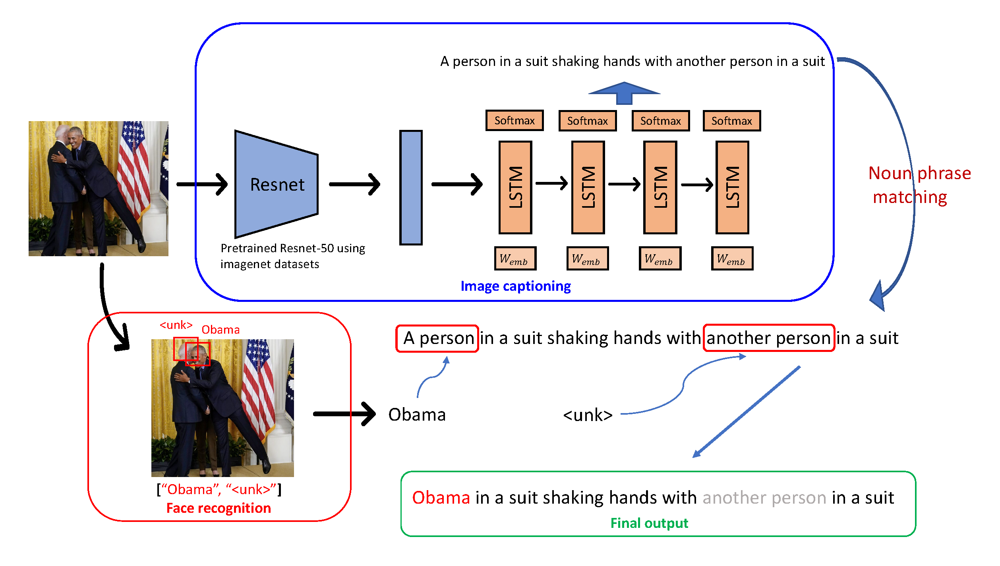
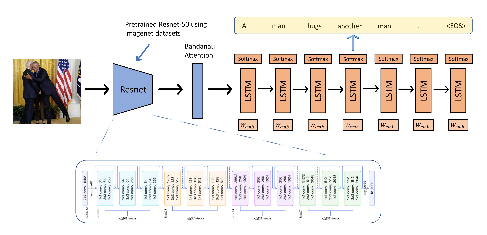
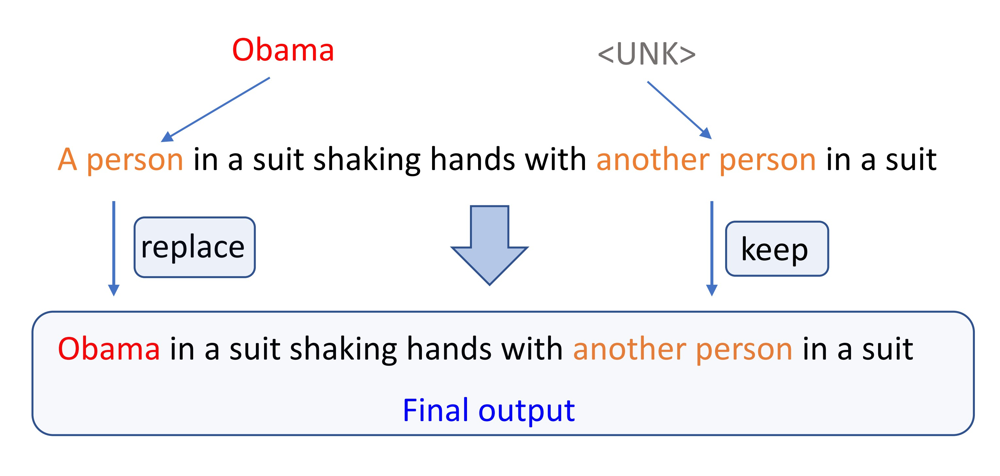

# image-captioning-for-celebrities

[updating]
- [image-captioning-for-celebrities](#image-captioning-for-celebrities)
  - [Overall architecture:](#overall-architecture)
  - [Image captioning part:](#image-captioning-part)
  - [Face recognition part:](#face-recognition-part)
  - [People noun phrase chunk matching:](#people-noun-phrase-chunk-matching)
  - [Datasets](#datasets)
  - [Dependencies](#dependencies)
  - [Usage:](#usage)
## Overall architecture:


## Image captioning part:


## Face recognition part:

We utilize the mtcnn module and the pretrained Inception_v1 in [facenet-pytorch](https://github.com/timesler/facenet-pytorch)


## People noun phrase chunk matching:


## Datasets
Download the following datasets and add them to relative paths:
1. [Flickr 8k](https://www.kaggle.com/datasets/adityajn105/flickr8k/download)
2. [Flickr 30k](https://www.kaggle.com/datasets/adityajn105/flickr30k/download)

## Dependencies
```
torch=1.10.1
python=3.9.7
numpy=1.21.5
matplotlib=3.5.1
torchvision=0.11.2 
spacy=3.2.1
nltk=3.7
```

## Usage:
model training is in [main.py](main.py). For a glance of the performance, see [example.ipynb](example.ipynb). 